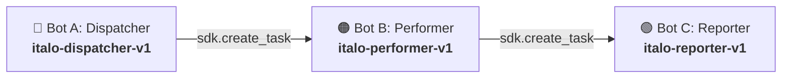

# Conferência de Lotes de Qualidade — Pipeline Híbrido RPA & ML (Estudo de Caso S10-B)

> **Convênio N.º 005/2025 (INOVA | IFAM | LG Electronics do Brasil Ltda.)**  
> **Polo Industrial de Manaus**  
> Sistema de auditoria e conformidade industrial com orquestração multi-bot no **BotCity Maestro**, enriquecimento inteligente por **Machine Learning** e tolerância a falhas multi-canal.

---

## 📌 Sumário
1. [Arquitetura de Orquestração Multi-Bot (3+ Bots)](#1-arquitetura-de-orquestração-multi-bot-3-bots)
2. [Soberania das Regras de Negócio Legadas (RN01–RN07)](#2-soberania-das-regras-de-negócio-legadas-rn01rn07)
3. [Blindagem e Resiliência de Machine Learning](#3-blindagem-e-resiliência-de-machine-learning)
4. [Sistema de Alertas com Fallback Multi-Canal](#4-sistema-de-alertas-com-fallback-multi-canal)
5. [Guia de Configuração e Instalação (Setup)](#5-guia-de-configuração-e-instalação-setup)
6. [Como Executar o Pipeline](#6-como-executar-o-pipeline)
7. [Suíte de Testes Automatizados](#7-suíte-de-testes-automatizados)

---

## 1. Arquitetura de Orquestração Multi-Bot (3+ Bots)

O pipeline divide as responsabilidades em três robôs independentes e encadeados via **BotCity Maestro SDK**:



| Bot | Label no Maestro | Responsabilidade Principal |
| :--- | :--- | :--- |
| **Bot A (Dispatcher)** | `italo-dispatcher-v1` | Lê a base diária (`data/processed/dados_relatorio.csv`), aplica validação preliminar (RN01), popula o DataPool (`FilaAuditoriaLotes-Eqp04`) e dispara o Bot B. |
| **Bot B (Performer)** | `italo-performer-v1` | Consome os lotes da fila, audita com as regras legadas (`RN01`–`RN07`), enriquece observações com o classificador defensivo de ML, atualiza o DataPool e dispara o Bot C. |
| **Bot C (Reporter)** | `italo-reporter-v1` | Consolida o relatório Excel final (`relatorio_auditoria_lotes.xlsx`) com as colunas `origem_decisao` e `confianca_ml`, monitora taxa de fallback, anexa artefatos na nuvem e emite alertas resilientes. |

---

## 2. Soberania das Regras de Negócio Legadas (RN01–RN07)

> [!IMPORTANT]
> **Decisão 100% Determinística:** A decisão de conformidade do lote (`CONFORME` ou `DIVERGÊNCIA`) é governada **exclusivamente pelo motor de regras legadas**. O modelo de ML atua estritamente no enriquecimento diagnóstico de causas prováveis.

* **RN01:** Presença obrigatória de todas as colunas de cabeçalho.
* **RN02:** Detecção e bloqueio de campos vazios ou nulos.
* **RN03:** Checagem de existência e status ativo na base cadastral de referência (`base_lotes_referencia.csv`).
* **RN04 / RN05:** Validação e normalização de status (`OK` $\rightarrow$ `APROVADO`, `NOK` $\rightarrow$ `REPROVADO`).
* **RN06:** Validação de consistência e formato de datas (`DD/MM/AAAA`).
* **RN07:** Validação de preenchimento obrigatório de justificativa/observação para lotes reprovados.

---

## 3. Blindagem e Resiliência de Machine Learning

O módulo [`src/classificador_divergencia.py`](file:///C:/Users/vivik/OneDrive/Documentos/Cudi%20Code/conferencia-lotes-qualidade/src/classificador_divergencia.py) implementa proteção absoluta para que nenhuma instabilidade no serviço de ML interrompa a operação:

### A. Controle por Feature Flag (`ML_ENABLED`)
* **`ML_ENABLED=true`:** O bot consulta o endpoint de predição.
* **`ML_ENABLED=false`:** O módulo desativa imediatamente chamadas de rede e retorna o fallback instantâneo (`origem_decisao: "fallback"`, `confianca_ml: 0.0`, `motivo_fallback: "ml_desabilitado"`).

### B. Blindagem contra Erros de Contrato e Rede
* **Timeout Agressivo:** Timeout estrito de `3.0s` na chamada HTTP via `requests`.
* **Captura Global e Absoluta:** O bloco `except Exception as e:` captura qualquer falha de contrato da API (HTTP 400, 422 Unprocessable Entity, 500, erros de decode JSON ou conexão), emitindo logs de aviso claros e não-genéricos (`ML Fallback: Falha de contrato/API...`) e forçando o fallback.
* **Limiar de Confiança (`ML_CONFIANCA_MINIMA`):** Predições com confiança inferior a `0.75` são descartadas automaticamente e encaminhadas para revisão com `origem_decisao: "fallback"`.

### C. Alerta de Degradação Crítica (100% Fallback)
Se **100% dos itens** processados pelo Bot B operarem no modo fallback de ML, o Bot C dispara um alerta para a equipe com severidade explícita **`AVISO`**, notificando a indisponibilidade ou inconsistência do modelo.

---

## 4. Sistema de Alertas com Fallback Multi-Canal

O sistema de alertas ([`src/bot/sistema_alertas.py`](file:///C:/Users/vivik/OneDrive/Documentos/Cudi%20Code/conferencia-lotes-qualidade/src/bot/sistema_alertas.py)) garante a entrega de notificações operacionais:

1. **Canal Principal (Telegram):** Envia a notificação formatada via Bot API.
2. **Canal de Contingência (Email SMTP):** Caso o Telegram falhe (token revogado, erro HTTP 401 ou timeout), o erro é capturado/engolido e o alerta é disparado automaticamente por Email com criptografia TLS.
3. **Não-Bloqueante:** Falhas de notificação nunca causam crash no robô.

---

## 5. Guia de Configuração e Instalação (Setup)

### 1. Clonar o Repositório e Criar Ambiente Virtual
```bash
git clone <url-do-repositorio>
cd conferencia-lotes-qualidade

python -m venv .venv
# Ativação no Windows:
.venv\Scripts\activate
# Ativação no Linux/macOS:
source .venv/bin/activate

pip install -r requirements.txt
pip install -r requirements-dev.txt
```

### 2. Configurar o Arquivo `.env`
Crie o seu `.env` a partir do template disponibilizado:
```bash
cp .env.example .env
```

Parâmetros disponíveis:
```env
# === BotCity Maestro ===
MAESTRO_ENABLED=true
BOTCITY_WORKSPACE=lg-cmdi
BOTCITY_SERVER=https://lgcmdi.botcity.dev
BOTCITY_LOGIN=seu_login
BOTCITY_KEY=sua_chave

# Labels das Automações e Fila
BOTCITY_DISPATCHER_LABEL=italo-dispatcher-v1
BOTCITY_PERFORMER_LABEL=italo-performer-v1
BOTCITY_REPORTER_LABEL=italo-reporter-v1
DATAPOOL_LABEL=FilaAuditoriaLotes-Eqp04

# === Machine Learning ===
ML_ENABLED=true
ML_CONFIANCA_MINIMA=0.75
ML_ENDPOINT=http://127.0.0.1:8000

# === Canais de Notificação ===
# Canal Principal (Telegram)
TELEGRAM_TOKEN=seu_token_botfather
TELEGRAM_CHAT_ID=seu_chat_id

# Canal Secundário (Email SMTP Fallback)
SMTP_SERVER=smtp.gmail.com
SMTP_PORT=587
SMTP_USER=seu_email@gmail.com
SMTP_PASSWORD=sua_senha_de_app
EMAIL_DESTINATION=destinatario@gmail.com
```

---

## 6. Como Executar o Pipeline

### Execução Local (Dry-Run / Testes de Desenvolvimento)
Para testar a cadeia completa localmente sem a necessidade do Maestro:
```bash
# 1. Executar o Dispatcher (Bot A)
python deploy/dispatcher/bot.py

# 2. Executar o Performer (Bot B)
python deploy/performer/bot.py

# 3. Executar o Reporter (Bot C)
python deploy/reporter/bot.py
```

### Execução em Nuvem (BotCity Maestro)
1. Faça o upload dos arquivos `.zip` localizados na pasta `dist/`:
   * `dist/italo-dispatcher-v1.zip`
   * `dist/italo-performer-v1.zip`
   * `dist/italo-reporter-v1.zip`
2. Certifique-se de que o DataPool `FilaAuditoriaLotes-Eqp04` esteja criado no painel.
3. Inicie o BotCity Runner e dispare a tarefa **`italo-dispatcher-v1`**. A cadeia de bots operará automaticamente até o relatório final.

---

## 7. Suíte de Testes Automatizados

A base conta com cobertura completa de testes unitários e de integração:

```bash
pytest tests/unit/ tests/integration/ -v
```

* **Testes de Regras de Negócio:** Validação das regras RN01 a RN07 e normalizações.
* **Testes de Classificador ML:** Prova de fallback para `ML_ENABLED=false`, timeout, HTTP 422 e baixa confiança.
* **Testes de Alertas:** Prova de chaveamento resiliente Telegram $\rightarrow$ Email SMTP.
* **Testes de Orquestração:** Prova do encadeamento via `sdk.create_task()`.
