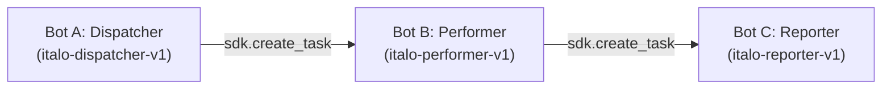

# Conferência de Lotes de Qualidade — Pipeline Híbrido RPA & ML (Estudo de Caso S10-B)

Sistema de conferência e auditoria de lotes de produção com orquestração multi-bot no **BotCity Maestro** e enriquecimento inteligente via **Machine Learning**.

---

## 🏗️ Arquitetura Multi-Bot (3+ Bots Orquestrados)

O pipeline é orquestrado em cadeia através do BotCity Maestro:



1. **Bot A (Dispatcher - `italo-dispatcher-v1`):** Ingestão do CSV de lotes (`data/processed/dados_relatorio.csv`), validação estrutural (RN01), população da fila (`FilaAuditoriaLotes-Eqp04`) e acionamento do Bot B via `sdk.create_task()`.
2. **Bot B (Performer - `italo-performer-v1`):** Consumo seguro de itens da fila, auditoria pelas regras de negócio legadas (`RN01` a `RN07`) e classificação de observações via API de Machine Learning defensiva (com blindagem absoluta contra erros 400/422/500 e timeout de 3s). Ao concluir, aciona o Bot C via `sdk.create_task()`.
3. **Bot C (Reporter - `italo-reporter-v1`):** Consolidação do relatório `.xlsx` (com colunas `origem_decisao` e `confianca_ml`), monitoramento de degradação de ML (alerta com severidade `AVISO` se 100% dos itens operarem em fallback), publicação de artefatos no Maestro e envio de alertas com resiliência multi-canal (Telegram $\rightarrow$ Fallback Email SMTP).

---

## 🚀 Setup e Instalação Local

### 1. Clonar e Instalar Dependências
```bash
git clone <url-do-repositorio>
cd conferencia-lotes-qualidade

# Criar e ativar ambiente virtual
python -m venv .venv
# Windows:
.venv\Scripts\activate
# Linux/macOS:
source .venv/bin/activate

# Instalar dependências
pip install -r requirements.txt
pip install -r requirements-dev.txt
```

### 2. Configuração de Variáveis de Ambiente
Copie o arquivo de exemplo para `.env`:
```bash
cp .env.example .env
```
Preencha as variáveis necessárias no `.env`:
* **BotCity Maestro:** `BOTCITY_WORKSPACE`, `BOTCITY_SERVER`, `BOTCITY_LOGIN`, `BOTCITY_KEY`
* **Machine Learning:** `ML_ENABLED=true`, `ML_CONFIANCA_MINIMA=0.75`, `ML_ENDPOINT=http://127.0.0.1:8000`
* **Notificações:** `TELEGRAM_TOKEN`, `TELEGRAM_CHAT_ID`, `SMTP_SERVER`, `SMTP_PORT`, `SMTP_USER`, `SMTP_PASSWORD`

---

## 🤖 Execução dos Bots

### Modo Local (Desenvolvimento / Dry-Run)
Para rodar os robôs individualmente no ambiente de desenvolvimento:
```bash
# 1. Bot A — Ingestão e Fila
python deploy/dispatcher/bot.py

# 2. Bot B — Auditoria e ML
python deploy/performer/bot.py

# 3. Bot C — Relatório e Alertas
python deploy/reporter/bot.py
```

### Modo Nuvem (BotCity Maestro)
1. Suba os pacotes gerados em `dist/` no painel do Maestro:
   * `dist/italo-dispatcher-v1.zip` $\rightarrow$ Automação `italo-dispatcher-v1`
   * `dist/italo-performer-v1.zip` $\rightarrow$ Automação `italo-performer-v1`
   * `dist/italo-reporter-v1.zip` $\rightarrow$ Automação `italo-reporter-v1`
2. Crie o DataPool `FilaAuditoriaLotes-Eqp04`.
3. Inicie o BotCity Runner e execute a tarefa inicial `italo-dispatcher-v1`.

---

## 🧪 Testes Automatizados

Para rodar toda a suíte de testes unitários e de integração:
```bash
pytest tests/unit/ tests/integration/ -v
```
São mais de 200 testes cobrindo regras de negócio, fallback de ML, tolerância a falhas e orquestração.
