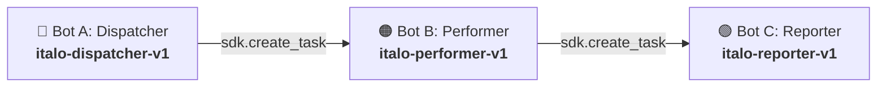

# Conferência de Lotes de Qualidade — Pipeline Híbrido RPA & ML (Estudo de Caso S10-B)

> **Convênio N.º 005/2025 (INOVA | IFAM | LG Electronics do Brasil Ltda.)**
> **Polo Industrial de Manaus**
> Sistema de auditoria e conformidade industrial com orquestração multi-bot no **BotCity Maestro**, enriquecimento inteligente por **Machine Learning** com blindagem defensiva, 4 camadas de resiliência e tolerância a falhas multi-canal.

---

## 📌 Sumário

1. [Arquitetura de Orquestração Multi-Bot (3+ Bots)](#1-arquitetura-de-orquestração-multi-bot-3-bots)
2. [Soberania das Regras de Negócio Legadas (RN01–RN07)](#2-soberania-das-regras-de-negócio-legadas-rn01rn07)
3. [4 Camadas de Resiliência e Tolerância a Falhas](#3-4-camadas-de-resiliência-e-tolerância-a-falhas)
4. [Sistema de Alertas com Fallback Multi-Canal](#4-sistema-de-alertas-com-fallback-multi-canal)
5. [Guia de Configuração e Instalação (Setup)](#5-guia-de-configuração-e-instalação-setup)
6. [Como Executar o Pipeline](#6-como-executar-o-pipeline)
7. [Simulação de Crise e Cenários de Falha (Sabotagem ao Vivo)](#7-simulação-de-crise-e-cenários-de-falha-sabotagem-ao-vivo)
8. [Suíte de Testes Automatizados](#8-suíte-de-testes-automatizados)
9. [Formulário de Revisão por Pares (S10-B)](#9-formulário-de-revisão-por-pares-s10-b)

---

## 1. Arquitetura de Orquestração Multi-Bot (3+ Bots)

O pipeline divide as responsabilidades em três robôs independentes e encadeados via **BotCity Maestro SDK** (`create_task`):



| Bot                          | Label no Maestro        | Responsabilidade Principal                                                                                                                                                                                                                                   |
| :--------------------------- | :---------------------- | :----------------------------------------------------------------------------------------------------------------------------------------------------------------------------------------------------------------------------------------------------------- |
| **Bot A (Dispatcher)** | `italo-dispatcher-v1` | Lê a base de entrada (`data/processed/dados_relatorio.csv`), valida a estrutura (RN01), popula o DataPool (`FilaAuditoriaLotes-Eqp04`) e dispara o Bot B.                                                                                               |
| **Bot B (Performer)**  | `italo-performer-v1`  | Conecta com Credentials Vault, carrega a base de referência com retry/backoff linear, audita via regras legadas (`RN01`–`RN07`), enriquece divergências com o classificador de ML defensivo, gera dead letter para falhas de dados e dispara o Bot C. |
| **Bot C (Reporter)**   | `italo-reporter-v1`   | Consolida o relatório Excel final (`relatorio_auditoria_lotes.xlsx`) com as colunas obrigatórias `origem_decisao` e `confianca_ml`, monitora degradação de ML (alerta `AVISO` para 100% fallback), posta artefatos e emite alertas multi-canal.  |

---

## 2. Soberania das Regras de Negócio Legadas (RN01–RN07)

> [!IMPORTANT]
> **Decisão 100% Determinística:** A decisão de conformidade do lote (`CONFORME`, `DIVERGENCIA` ou `PENDENTE_REVISAO`) é governada **exclusivamente pelo motor de regras legadas**. O modelo de ML atua estritamente no enriquecimento diagnóstico de causas prováveis para observações em texto livre.

* **RN01:** Presença obrigatória de todas as colunas de cabeçalho.
* **RN02:** Detecção e bloqueio de campos essenciais vazios ou nulos (`lote_id`, `produto`, `linha`, etc.).
* **RN03:** Checagem de existência e status ativo na base de referência (`base_lotes_referencia.csv`).
* **RN04 / RN05:** Validação e normalização de status (`OK` $\rightarrow$ `APROVADO`, `NOK` $\rightarrow$ `REPROVADO`).
* **RN06:** Validação de consistência e formato de datas (`DD/MM/AAAA`).
* **RN07:** Validação de preenchimento obrigatório de justificativa/observação para lotes reprovados.

---

## 3. 4 Camadas de Resiliência e Tolerância a Falhas

```
┌─────────────────────────────────────────────────────────────────────────────┐
│ 1. RETRY COM BACKOFF LINEAR (Infraestrutura Crítica)                        │
│    carregar_base_com_retry(): 3 tentativas (1s, 2s, 3s).                    │
│    Se falhar persistentemente → Alerta ERRO + Itens PENDENTE_REVISAO.       │
├─────────────────────────────────────────────────────────────────────────────┤
│ 2. DEAD LETTER (Falhas de Dado Irrecuperáveis)                              │
│    Itens com divergências de dados (ErrorType.BUSINESS) são persistidos     │
│    em data/output/dead_letter.jsonl para auditoria assíncrona.              │
├─────────────────────────────────────────────────────────────────────────────┤
│ 3. CLASSIFICADOR ML DEFENSIVO (src/classificador_divergencia.py)           │
│    Feature flag ML_ENABLED, timeout 3.0s, limiar ML_CONFIANCA_MINIMA e      │
│    motivos de fallback distintos: timeout, servico_offline, baixa_confianca. │
├─────────────────────────────────────────────────────────────────────────────┤
│ 4. ALERTA MULTI-CANAL RESILIENTE (src/bot/sistema_alertas.py)               │
│    Telegram (Principal) → Email SMTP (Fallback) → WhatsApp Twilio (Fallback)│
└─────────────────────────────────────────────────────────────────────────────┘
```

### Detalhamento do Classificador de ML (`src/classificador_divergencia.py`)

- **Feature Flag (`ML_ENABLED`):** Quando `false`, retorna fallback imediato com `motivo_fallback: "ml_desabilitado"` sem realizar chamadas de rede.
- **Limiar de Confiança (`ML_CONFIANCA_MINIMA`):** Predições com score abaixo do configurado (padrão `0.75`) são descartadas com `motivo_fallback: "baixa_confianca"`.
- **Captura Hierárquica:**
  - `requests.exceptions.Timeout` $\rightarrow$ `motivo_fallback: "timeout"`
  - `requests.exceptions.ConnectionError` $\rightarrow$ `motivo_fallback: "servico_offline"`
  - `Exception` (HTTP 4xx/5xx, JSON inválido) $\rightarrow$ `motivo_fallback: "falha_contrato_api"`
- **Alerta de 100% Fallback:** Se todos os itens caírem em fallback durante a execução, o Bot C dispara alerta com severidade **`AVISO`**.

---

## 4. Sistema de Alertas com Fallback Multi-Canal

O módulo [`src/bot/sistema_alertas.py`](file:///c:/Users/Turma01/Desktop/conferencia-lotes-qualidade/src/bot/sistema_alertas.py) entrega tolerância a falhas completa:

1. **Canal Principal (Telegram):** Notificação com formatação Markdown.
2. **Canal Secundário (Email SMTP):** TLS com fallback automático em caso de token inválido, erro 401 ou timeout no Telegram.
3. **Canal Terciário (WhatsApp via Twilio):** Fallback adicional para eventos de alta severidade.
4. **Resiliência Absoluta:** Nenhuma falha de envio de alerta interrompe o pipeline.

---

## 5. Guia de Configuração e Instalação (Setup)

### 1. Clonar o Repositório e Criar Ambiente Virtual

```bash
git clone <url-do-repositorio>
cd conferencia-lotes-qualidade

python -m venv .venv
# Ativação no Windows (PowerShell):
.\.venv\Scripts\Activate.ps1
# Ativação no Linux/macOS:
source .venv/bin/activate

pip install -r requirements.txt
pip install -r requirements-dev.txt
```

### 2. Configurar o Arquivo `.env`

```bash
cp .env.example .env
```

Conteúdo recomendado do `.env`:

```env
# === Flags de Execução ===
MAESTRO_ENABLED=false
VAULT_ENABLED=false

# === Caminhos ===
PASTA_ENTRADA=data/processed
PASTA_SAIDA=data/output
ARQUIVO_CSV_ENTRADA=dados_relatorio.csv
CAMINHO_BASE_REFERENCIA=data/processed/base_lotes_referencia.csv

# === BotCity Maestro Labels ===
BOTCITY_DISPATCHER_LABEL=italo-dispatcher-v1
BOTCITY_PERFORMER_LABEL=italo-performer-v1
BOTCITY_REPORTER_LABEL=italo-reporter-v1
DATAPOOL_LABEL=FilaAuditoriaLotes-Eqp04

# === Machine Learning ===
ML_ENABLED=true
ML_CONFIANCA_MINIMA=0.75
ML_ENDPOINT=http://127.0.0.1:8000

# === Canais de Notificação ===
TELEGRAM_TOKEN=seu_token_botfather
TELEGRAM_CHAT_ID=seu_chat_id
SMTP_SERVER=smtp.gmail.com
SMTP_PORT=587
SMTP_USER=seu_email@gmail.com
SMTP_PASSWORD=sua_senha_de_app
EMAIL_DESTINATION=destinatario@empresa.com
```

---

## 6. Como Executar o Pipeline

### Execução Local (Dry-Run Completo)

Para executar a cadeia completa de 3 bots sequenciais localmente:

```bash
# 1. Bot A — Dispatcher (validação inicial e enfileiramento)
python deploy/dispatcher/bot.py

# 2. Bot B — Performer (avaliação RN01-RN07, ML defensivo, retry, dead letter)
python deploy/performer/bot.py

# 3. Bot C — Reporter (consolidação Excel, checagem de degradação, alertas)
python deploy/reporter/bot.py
```

### Execução em Nuvem (BotCity Maestro)

1. Suba os pacotes de cada bot (`italo-dispatcher-v1`, `italo-performer-v1`, `italo-reporter-v1`) no painel do Maestro.
2. Certifique-se de que o DataPool `FilaAuditoriaLotes-Eqp04` e a credencial `credencial_erp_eqp04` estejam cadastrados.
3. Configure `MAESTRO_ENABLED=true` e dispare a tarefa inicial `italo-dispatcher-v1`.

---

## 7. Simulação de Crise e Cenários de Falha (Sabotagem ao Vivo)

Abaixo estão as instruções para demonstrar os **5 cenários de teste** da banca e do grupo revisor:

### 🔴 Cenário 1: Rede Instável na Base de Referência

* **Sabotagem:** Renomear/bloquear temporariamente a base `data/processed/base_lotes_referencia.csv`.
* **Comportamento:** O Bot B aciona retry com backoff linear (1s, 2s, 3s). Ao esgotar as tentativas, dispara alerta com severidade `ERRO` e classifica os itens como `PENDENTE_REVISAO` sem interromper o lote.

### 🔴 Cenário 2: Serviço de ML Fora do Ar

* **Sabotagem:** Desligar a API de ML ou definir `ML_ENDPOINT=http://localhost:9999`.
* **Comportamento:** O classificador captura `ConnectionError`, registra `motivo_fallback: "servico_offline"`, define `origem_decisao: "fallback"` e o pipeline conclui normalmente.

### 🔴 Cenário 3: ML Lento (Acima do Timeout de 3s)

* **Sabotagem:** Forçar atraso na resposta da API de ML (mock ou delay de rede).
* **Comportamento:** Timeout de 3.0s é respeitado, classificador registra `motivo_fallback: "timeout"` e o bot não fica bloqueado.

### 🔴 Cenário 4: ML com Baixa Confiança

* **Sabotagem:** Definir `ML_CONFIANCA_MINIMA=0.99` ou modelo retornar score inferior ao limiar.
* **Comportamento:** Predição descartada com `motivo_fallback: "baixa_confianca"`, item registrado como fallback.

### 🔴 Cenário 5: Canal de Alerta Principal Falha (Telegram)

* **Sabotagem:** Definir `TELEGRAM_TOKEN=token_invalido_revogado`.
* **Comportamento:** Erro do Telegram é absorvido, logado e o alerta é automaticamente entregue pelo canal de contingência (Email SMTP / WhatsApp).

---

## 8. Suíte de Testes Automatizados

Para rodar todos os testes de unidade e integração:

```bash
.\.venv\Scripts\python.exe -m pytest tests/unit/ -v
```

Testes específicos de resiliência e conformidade S10-B:

```bash
.\.venv\Scripts\python.exe -m pytest tests/unit/test_classificador_divergencia.py tests/unit/test_retry_e_dead_letter.py tests/unit/test_sistema_alertas.py tests/unit/test_orquestracao_bots.py -v
```

---

## 9. Formulário de Revisão por Pares (S10-B)

| Critério Avaliado                                   |     Status     | Evidência no Código                                                                                                  |
| :--------------------------------------------------- | :-------------: | :--------------------------------------------------------------------------------------------------------------------- |
| **1. Orquestração Multi-Bot (3+ bots)**      | ✅**SIM** | `config.py` (`italo-dispatcher-v1`, `italo-performer-v1`, `italo-reporter-v1`) e `create_task()` sequencial. |
| **2. Rastreabilidade da Cadeia**               | ✅**SIM** | Parâmetros`origem`, `datapool`, `total_itens`, `task_id` passados entre bots.                                 |
| **3. ML Desligável via Env (`ML_ENABLED`)** | ✅**SIM** | `src/classificador_divergencia.py` desativa chamadas sem alterar código.                                            |
| **4. Decisão de Status Independente do ML**   | ✅**SIM** | `src/bot/avaliador.py` aplica RN01–RN07 antes e de forma isolada ao ML.                                             |
| **5. Limiar de Confiança Configurável**      | ✅**SIM** | `ML_CONFIANCA_MINIMA` respeitado em `src/classificador_divergencia.py`.                                            |
| **6. ML Nunca Lança Exceção**               | ✅**SIM** | Captura hierárquica`RequestsTimeout`, `RequestsConnectionError` e `Exception`.                                  |
| **7. Retry + Backoff na Infraestrutura**       | ✅**SIM** | `carregar_base_com_retry()` em `src/bot/performer.py` com backoff linear 1s/2s/3s.                                 |
| **8. Dead Letter para Falhas de Dado**         | ✅**SIM** | `registrar_dead_letter()` grava itens `ErrorType.BUSINESS` em `data/output/dead_letter.jsonl`.                   |
| **9. Notificação Multi-Canal com Fallback**  | ✅**SIM** | `src/bot/sistema_alertas.py` (Telegram $\rightarrow$ Email SMTP $\rightarrow$ WhatsApp).                         |
| **10. Alerta de Degradação (100% Fallback)** | ✅**SIM** | `verificar_alerta_degradacao_ml()` no Bot C com severidade `AVISO`.                                                |
| **11. Rastreabilidade no Relatório Final**    | ✅**SIM** | Colunas`origem_decisao`, `confianca_ml` e `status_auditoria` em `relatorio_auditoria_lotes.xlsx`.              |
| **12. Motivo do Fallback Distinto nos Logs**   | ✅**SIM** | Logs discriminam`ml_desabilitado`, `timeout`, `servico_offline`, `baixa_confianca`, `falha_contrato_api`.    |
