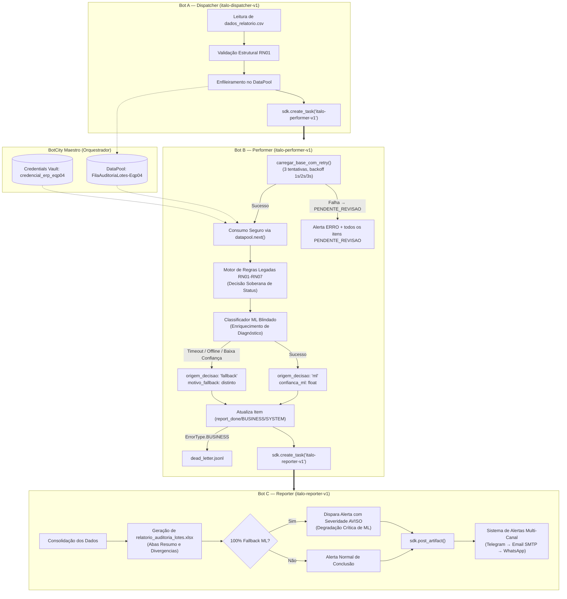

# PDD — Process Design Document: Estudo de Caso S10-B
## Pipeline Híbrido RPA & Machine Learning de Conferência de Lotes

**Convênio N.º 005/2025 (INOVA | IFAM | LG Electronics do Brasil Ltda.)**  
**Polo Industrial de Manaus**

---

## 1. Visão Geral e Objetivo do Negócio

Automatizar e auditar a conferência diária de lotes industriais através de uma arquitetura distribuída multi-bot no **BotCity Maestro**, complementada por um modelo de **Machine Learning defensivo** para enriquecimento de causas de divergência e um sistema de **alertas com tolerância a falhas multi-canal**.

---

## 2. Arquitetura de Orquestração Multi-Bot (3+ Bots em Cadeia)

O ecossistema opera de forma desacoplada em três robôs orquestrados via `BotMaestroSDK`:



---

## 3. Regras de Negócio e Soberania das Regras Legadas (RN01 a RN07)

| Código | Regra de Negócio | Ação / Classificação |
| :--- | :--- | :--- |
| **RN01** | Estrutura de colunas obrigatórias no CSV | Bloqueia processamento se o formato estiver inválido |
| **RN02** | Campos essenciais não podem ser nulos/vazios (`lote_id`, `produto`, `linha`, etc.) | Registra `DIVERGÊNCIA` |
| **RN03** | Lote deve existir e estar ativo na `base_lotes_referencia.csv` | Registra `DIVERGÊNCIA` se ausente ou inativo |
| **RN04** | Validação do status informado (`APROVADO`, `REPROVADO`, `PENDENTE`, etc.) | Identifica inconsistências |
| **RN05** | Normalização de grafia (`OK` → `APROVADO`, `NOK` → `REPROVADO`) | Padroniza para análise consistente |
| **RN06** | Consistência e formato de datas (`DD/MM/AAAA`) | Registra `DIVERGÊNCIA` para datas malformadas |
| **RN07** | Lotes com status `REPROVADO` exigem campo `observacao` preenchido | Registra `DIVERGÊNCIA` se observação vazia |

> [!IMPORTANT]
> **Soberania do Motor de Regras:** A decisão de conformidade (`CONFORME` ou `DIVERGÊNCIA`) é definida **100% pelas regras legadas RN01–RN07**. O Machine Learning não tem autoridade para aprovar ou reprovar lotes, atuando unicamente no enriquecimento diagnóstico da causa provável.

---

## 4. Arquitetura de Resiliência e Blindagem de Falhas (ML e Alertas)

### 4.1. Classificador Defensivo de ML (`src/classificador_divergencia.py`)
* **Feature Flag:** Respeita `ML_ENABLED`. Se `false`, retorna fallback instantaneamente com `motivo_fallback: "ml_desabilitado"`.
* **Timeout Agressivo:** Timeout de 3.0 segundos no `requests.post()`.
* **Captura Hierárquica de Exceções:**
  * `requests.exceptions.Timeout` → `motivo_fallback: "timeout"`
  * `requests.exceptions.ConnectionError` → `motivo_fallback: "servico_offline"`
  * Demais falhas (HTTP 4xx/5xx, JSON malformado) → `motivo_fallback: "falha_contrato_api"`
* **Calibração de Confiança:** Predições com score inferior a `ML_CONFIANCA_MINIMA` (0.75) são descartadas com `motivo_fallback: "baixa_confianca"`.

### 4.2. Sistema de Notificação Resiliente (`src/bot/sistema_alertas.py`)
* **Canal Principal:** Telegram (via Bot API).
* **Canal de Contingência (Fallback 1):** Email SMTP com TLS.
* **Canal de Contingência (Fallback 2):** WhatsApp via Twilio.
* **Tolerância a Falhas:** Exceções são capturadas, logadas e nunca propagadas ao bot.

### 4.3. Monitoramento de Degradação (Alerta com Severidade AVISO)
* Se **100% dos itens** processados caírem em fallback de ML, o Bot C emite um alerta específico para o time com severidade **`AVISO`**.

---

## 5. Modelo de Dados — Campos de Auditoria de ML no Relatório Final

| Campo | Tipo | Descrição |
| :--- | :--- | :--- |
| `lote_id` | string | Identificador do lote |
| `status_auditoria` | string | `CONFORME`, `DIVERGENCIA` ou `PENDENTE_REVISAO` |
| `origem_decisao` | string | `ml` (classificado com sucesso) ou `fallback` |
| `confianca_ml` | float | Score de confiança do modelo (0.0 a 1.0) |
| `causa_provavel` | string | Causa sugerida pelo ML ou `"nao_classificado"` |
| `regra` | string | Código da regra violada (RN02, RN03, etc.) |

---

## 6. Fluxo de Exceção e Resiliência — Camadas de Tratamento

Esta seção descreve as **quatro camadas de resiliência** do pipeline e como cada tipo de falha é tratado de forma distinta.

### 6.1 Camada 1 — Retry com Backoff Linear (Base de Referência)

**Componente:** `src/bot/performer.py` → `carregar_base_com_retry()`  
**Tipo de falha:** Infraestrutura crítica (rede instável, arquivo temporariamente inacessível)

```
Tentativa 1 → aguarda 1s → Tentativa 2 → aguarda 2s → Tentativa 3 → falha
                                                                      ↓
                                          Alerta ERRO via sistema_alertas
                                          Todos os itens → PENDENTE_REVISAO
```

**Parâmetros configuráveis (código):**
* `_RETRY_TENTATIVAS = 3`
* `_RETRY_BACKOFF_BASE_S = 1.0` (backoff linear: tentativa × base = 1s, 2s, 3s)

**Comportamento:** O pipeline **não encerra** — continua processando todos os itens com `status_auditoria: PENDENTE_REVISAO` até que a base seja restaurada.

### 6.2 Camada 2 — Dead Letter (Falhas de Dado Irrecuperáveis)

**Componente:** `src/bot/performer.py` → `registrar_dead_letter()`  
**Arquivo de saída:** `data/output/dead_letter.jsonl`  
**Tipo de falha:** Dado inválido (`ErrorType.BUSINESS`) — lote não cadastrado, campo obrigatório vazio, etc.

**Diferença fundamental:**

| Tipo de Falha | Tratamento | Arquivo de Saída |
| :--- | :--- | :--- |
| Dado inválido (BUSINESS) | Dead letter | `data/output/dead_letter.jsonl` |
| Infraestrutura (SYSTEM) | Retry + PENDENTE_REVISAO | — |
| ML indisponível | Fallback automático | Campo `motivo_fallback` no relatório |

### 6.3 Camada 3 — Fallback do Classificador de ML

**Componente:** `src/classificador_divergencia.py`  
**Tipo de falha:** Serviço de ML (timeout, offline, baixa confiança, contrato de API)

| Exceção capturada | `motivo_fallback` | O bot para? |
| :--- | :--- | :--- |
| ML_ENABLED=false | `ml_desabilitado` | Não |
| `requests.Timeout` | `timeout` | Não |
| `requests.ConnectionError` | `servico_offline` | Não |
| Confiança < limiar | `baixa_confianca` | Não |
| HTTP 400/422/500, JSON inválido | `falha_contrato_api` | Não |

### 6.4 Camada 4 — Fallback de Canal de Alerta

**Componente:** `src/bot/sistema_alertas.py`  
**Prioridade:** Telegram → Email SMTP → WhatsApp Twilio → log local  

Se todos os canais falharem, o resultado `{"sucesso": False, "canal_utilizado": "nenhum"}` é retornado — o pipeline **não é interrompido**.

---

## 7. Cenários de Falha Testados (Simulação de Crise)

| Cenário | Como Simular | Comportamento Esperado |
| :--- | :--- | :--- |
| Rede instável na base de referência | Renomear `base_lotes_referencia.csv` durante execução | Retry 3×; alerta ERRO; todos os itens → PENDENTE_REVISAO |
| Serviço de ML fora do ar | `ML_ENDPOINT=http://localhost:9999` (porta inválida) | `motivo_fallback: servico_offline`; bot não para |
| ML lento (acima do timeout) | Mock com `time.sleep(5)` no endpoint | `motivo_fallback: timeout`; bot não fica esperando |
| ML com baixa confiança | Mock retorna `confianca: 0.30` | `motivo_fallback: baixa_confianca`; fallback aplicado |
| Canal de alerta principal falha | `TELEGRAM_TOKEN=token_invalido` | Alerta chega via Email SMTP ou WhatsApp |

---

## 8. Critérios de Aceite Mapeados ao Código

| Critério (Enunciado §8) | Implementação | Arquivo |
| :--- | :--- | :--- |
| 3+ bots com dependência e cadeia rastreável | `disparar_bot_b()` e `disparar_bot_c()` com `create_task()` | `dispatcher.py`, `performer.py` |
| ML isolado por abstração | Toda chamada ao ML está em `classificar_divergencia()` | `classificador_divergencia.py` |
| Decisão de negócio independente do ML | ML só é chamado **após** `avaliar_lote()` | `performer.py` |
| ML nunca lança exceção | `except RequestsTimeout / ConnectionError / Exception` | `classificador_divergencia.py` |
| Bot nunca para | Base indisponível → PENDENTE_REVISAO, não encerramento | `performer.py` |
| Rastreabilidade completa | `origem_decisao`, `confianca_ml` em todo item de divergência | `reporter.py` |
| Notificação resiliente | Fallback Telegram → Email → WhatsApp → log | `sistema_alertas.py` |

---

## 9. Checklist de Qualidade

### 9.1 Orquestração

- [x] 3+ bots registrados com nomenclatura `italo-dispatcher-v1`, `italo-performer-v1`, `italo-reporter-v1`
- [x] Dependência sequencial via `create_task()`: A→B→C
- [x] Cadeia de execução rastreável nos parâmetros de task (`origem`, `task_id`, `total_itens`)
- [x] Modo dry-run funcional para desenvolvimento local sem Maestro

### 9.2 Decisão Híbrida RPA+ML

- [x] `ML_ENABLED=false` desliga completamente a chamada HTTP (confirmado em teste unitário)
- [x] Decisão de status do item depende exclusivamente de RN01–RN07
- [x] Limiar `ML_CONFIANCA_MINIMA` configurável via `.env` e respeitado no classificador
- [x] `origem_decisao` e `confianca_ml` presentes em todo item de divergência no relatório

### 9.3 Resiliência

- [x] Retry com backoff linear (1s, 2s, 3s) para base de referência
- [x] Dead letter (`data/output/dead_letter.jsonl`) para falhas de dado (BUSINESS)
- [x] PENDENTE_REVISAO para falhas de infraestrutura (base indisponível após retries)
- [x] ML blindado: timeout, offline e baixa confiança tratados como casos distintos
- [x] Nenhuma exceção do ML propaga ao loop principal do bot

### 9.4 Auditoria e Notificação

- [x] `origem_decisao` e `confianca_ml` presentes no Excel final sem registros faltando
- [x] Alerta "100% fallback ML" com severidade `AVISO` implementado e testado
- [x] Fallback de canal: Telegram → Email → WhatsApp → log local
- [x] `motivo_fallback` distinto para cada tipo de falha do ML (rastreabilidade de log)

### 9.5 Simulação e Entrega

- [x] README documenta como ligar/desligar ML e configurar canais de notificação
- [x] README documenta como reproduzir os 5 cenários de falha
- [x] Testes unitários cobrem todos os cenários de resiliência
- [x] Branch `feature/S10B-Eqp04` com pipeline completo

---

## 16. Guia de Configuração do Ambiente

### 16.1 Variáveis de Ambiente Obrigatórias

| Variável | Padrão | Descrição |
| :--- | :--- | :--- |
| `MAESTRO_ENABLED` | `false` | Liga integração com BotCity Maestro |
| `ML_ENABLED` | `true` | Liga/desliga o classificador de ML sem alterar código |
| `ML_CONFIANCA_MINIMA` | `0.75` | Predições abaixo deste valor vão para fallback |
| `ML_ENDPOINT` | `http://127.0.0.1:8000` | Endpoint da API de classificação |
| `TELEGRAM_TOKEN` | — | Token do bot no BotFather |
| `TELEGRAM_CHAT_ID` | — | ID do grupo/canal de alertas |
| `SMTP_USER` / `SMTP_PASSWORD` | — | Credenciais do Email de fallback |

### 16.2 Configuração de ML

**Para ligar o ML:**
```env
ML_ENABLED=true
ML_ENDPOINT=http://127.0.0.1:8000
ML_CONFIANCA_MINIMA=0.75
```

**Para desligar o ML (modo fallback total):**
```env
ML_ENABLED=false
```

**Para iniciar a API de ML localmente:**
```bash
# Com Docker
docker-compose up api_ml

# Ou diretamente
cd api_ml && uvicorn main:app --port 8000
```

### 16.3 Configuração dos Canais de Notificação

**Canal Principal (Telegram):**
```env
TELEGRAM_TOKEN=seu_token_do_botfather
TELEGRAM_CHAT_ID=id_do_grupo_ou_canal
```

**Canal de Fallback (Email SMTP):**
```env
SMTP_SERVER=smtp.gmail.com
SMTP_PORT=587
SMTP_USER=email@gmail.com
SMTP_PASSWORD=senha_de_app_gmail
EMAIL_DESTINATION=destinatario@empresa.com
```

**Canal de Fallback Alternativo (WhatsApp via Twilio):**
```env
TWILIO_ACCOUNT_SID=seu_account_sid
TWILIO_AUTH_TOKEN=seu_auth_token
TWILIO_PHONE_NUMBER=+14155238886
WHATSAPP_DESTINATION=+5511999999999
```

---

## 17. Roteiro de Simulação de Crise (Sabotagem ao Vivo)

Este roteiro permite que o grupo ensaie os cinco cenários de falha antes da apresentação.

### Cenário 1 — Rede Instável na Base de Referência

```bash
# 1. Renomear a base (simula inacessibilidade)
mv data/processed/base_lotes_referencia.csv data/processed/base_BLOQUEADA.csv

# 2. Executar o Performer
python deploy/performer/bot.py

# Esperado no log:
# [RETRY 1/3] Falha ao carregar base... aguardando 1s
# [RETRY 2/3] Falha ao carregar base... aguardando 2s
# [RETRY 3/3] Todas as tentativas esgotadas. Acionando PENDENTE_REVISAO.
# Alerta ERRO disparado via Telegram (ou fallback)

# 3. Restaurar a base
mv data/processed/base_BLOQUEADA.csv data/processed/base_lotes_referencia.csv
```

### Cenário 2 — Serviço de ML Fora do Ar

```bash
# Apontar para endpoint inválido (porta fechada)
export ML_ENABLED=true
export ML_ENDPOINT=http://localhost:9999

python deploy/performer/bot.py

# Esperado no log:
# ML Fallback [servico_offline]: não foi possível conectar ao endpoint
# Todos os itens: origem_decisao=fallback, motivo_fallback=servico_offline
# Bot C: alerta de 100% fallback com severidade AVISO
```

### Cenário 3 — ML Lento (Acima do Timeout de 3s)

```bash
# Modificar temporariamente o endpoint para um que adiciona delay
# (ou usar o mock de timeout nos testes automatizados)
pytest tests/unit/test_classificador_divergencia.py::test_ml_timeout_retorna_fallback -v

# Esperado: motivo_fallback=timeout, bot não fica bloqueado
```

### Cenário 4 — ML com Baixa Confiança

```bash
# Forçar resposta do modelo com confiança abaixo do limiar
export ML_CONFIANCA_MINIMA=0.99  # limiar alto para simular baixa confiança

python deploy/performer/bot.py

# Esperado no log:
# ML Fallback [baixa_confianca]: confiança X.XX abaixo do limiar 0.99
# Todos os itens: origem_decisao=fallback, motivo_fallback=baixa_confianca
```

### Cenário 5 — Canal de Alerta Principal Falha (Telegram)

```bash
# Invalidar o token do Telegram
export TELEGRAM_TOKEN=token_invalido_revogado

python deploy/performer/bot.py

# Esperado no log:
# Falha no canal principal (Telegram): ... Acionando canal de contingência...
# Alerta entregue com sucesso através do canal de contingência (Email SMTP)
# fallback_acionado=True
```

### Roteiro Completo de Ensaio (30 minutos)

1. **[5 min]** Validar que o pipeline roda normalmente: `python deploy/dispatcher/bot.py`
2. **[5 min]** Simular Cenário 1 (base inacessível) e confirmar log de retry + alerta
3. **[5 min]** Simular Cenário 2 (ML offline) e confirmar `motivo_fallback: servico_offline`
4. **[5 min]** Simular Cenário 4 (baixa confiança) e confirmar alerta "100% fallback"
5. **[5 min]** Simular Cenário 5 (Telegram inválido) e confirmar fallback de canal
6. **[5 min]** Abrir `data/output/dead_letter.jsonl` e confirmar itens com falha de dado
