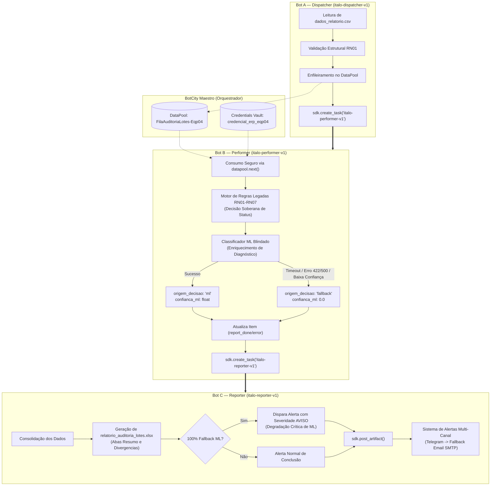

# PDD — Process Design Document: Estudo de Caso S10-B
## Pipeline Híbrido RPA & Machine Learning de Conferência de Lotes

**Convênio N.º 005/2025 (INOVA | IFAM | LG Electronics do Brasil Ltda.)**  
**Polo Industrial de Manaus**

---

## 1. Visão Geral e Objetivo do Negócio

Automatizar e auditar a conferência diária de lotes industriais através de uma arquitetura distribuída multi-bot no **BotCity Maestro**, complementada por um modelo de **Machine Learning defensivo** para enriquecimento de causas de divergência e um sistema de **alertas com tolerância a falhas multi-canal**.

---

## 2. Arquitetura de Orquestração Multi-Bot (3+ Bots em Cadeia)

O ecossistema opera de forma desacoplada em três robôs orquestrados via `BotMaestroSDK`:

---

## 3. Regras de Negócio e Soberania das Regras Legadas (RN01 a RN07)

| Código | Regra de Negócio | Ação / Classificação |
| :--- | :--- | :--- |
| **RN01** | Estrutura de colunas obrigatórias no CSV | Bloqueia processamento se o formato estiver inválido |
| **RN02** | Campos essenciais não podem ser nulos/vazios (`lote_id`, `produto`, `linha`, etc.) | Registra `DIVERGÊNCIA` |
| **RN03** | Lote deve existir e estar ativo na `base_lotes_referencia.csv` | Registra `DIVERGÊNCIA` se ausente ou inativo |
| **RN04** | Validação do status informado (`APROVADO`, `REPROVADO`, `PENDENTE`, etc.) | Identifica inconsistências |
| **RN05** | Normalização de grafia (`OK` $\rightarrow$ `APROVADO`, `NOK` $\rightarrow$ `REPROVADO`) | Padroniza para análise consistente |
| **RN06** | Consistência e formato de datas (`DD/MM/AAAA`) | Registra `DIVERGÊNCIA` para datas malformadas |
| **RN07** | Lotes com status `REPROVADO` exigem campo `observacao` preenchido | Registra `DIVERGÊNCIA` se observação vazia |

> [!IMPORTANT]
> **Soberania do Motor de Regras:** A decisão de conformidade (`CONFORME` ou `DIVERGÊNCIA`) é definida **100% pelas regras legadas RN01–RN07**. O Machine Learning não tem autoridade para aprovar ou reprovar lotes, atuando unicamente no enriquecimento diagnóstico da causa provável.

---

## 4. Arquitetura de Resiliência e Blindagem de Falhas (ML e Alertas)

### 4.1. Classificador Defensivo de ML (`src/classificador_divergencia.py`)
* **Feature Flag:** Respeita `ML_ENABLED`. Se `false`, retorna fallback instantaneamente com `motivo_fallback: "ml_desabilitado"`.
* **Timeout Agressivo:** Timeout de 3.0 segundos no `requests.post()` para evitar travamento de threads no runner.
* **Blindagem Absoluta contra Erros de Contrato (400, 422, 500) e Rede:** O try/except global absorve qualquer falha de contrato da API (ex.: payload textual vs. one-hot encoding), loga como `warning` não-genérico e entrega o dicionário de fallback seguro.
* **Calibração de Confiança:** Predições com score inferior a `ML_CONFIANCA_MINIMA` (0.75) são descartadas para auditoria humana.

### 4.2. Sistema de Notificação Resiliente (`src/bot/sistema_alertas.py`)
* **Canal Principal:** Telegram (via Bot API).
* **Canal de Contingência (Fallback):** Email SMTP com TLS.
* **Tolerância a Falhas:** Em caso de token do Telegram revogado/excluído ao vivo, timeout ou instabilidade de rede, a exceção é capturada, logada, e o alerta é disparado automaticamente via Email SMTP sem abortar a tarefa.

### 4.3. Monitoramento de Degradação (Alerta com Severidade AVISO)
* Se **100% dos itens** processados caírem em fallback de ML, o Bot C emite um alerta específico para o time de suporte com severidade **`AVISO`**, indicando degradação crítica no serviço de IA.
